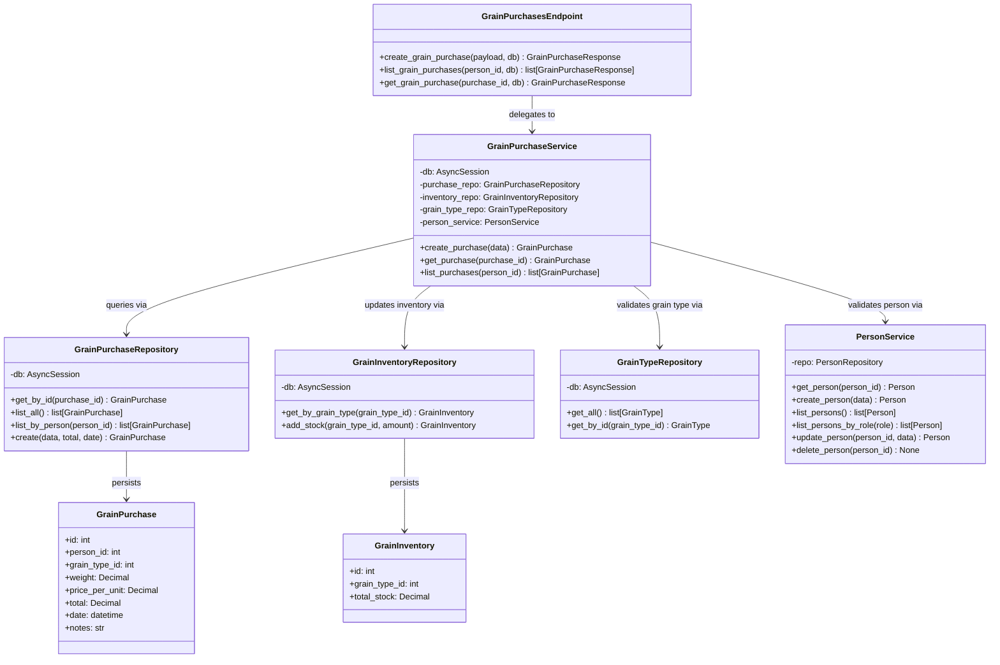

## Grain Purchases — Class Diagram

This diagram shows the classes that make up the grain purchases module and the supporting classes they depend on. The three route handlers in `GrainPurchasesEndpoint` delegate all logic to `GrainPurchaseService`. The service owns instances of `GrainPurchaseRepository`, `GrainInventoryRepository`, and `GrainTypeRepository`, and delegates person lookup and role validation to `PersonService`. Method signatures are taken directly from the source files; `GrainPurchase` and `GrainInventory` are SQLAlchemy ORM models (fields listed, no methods).

