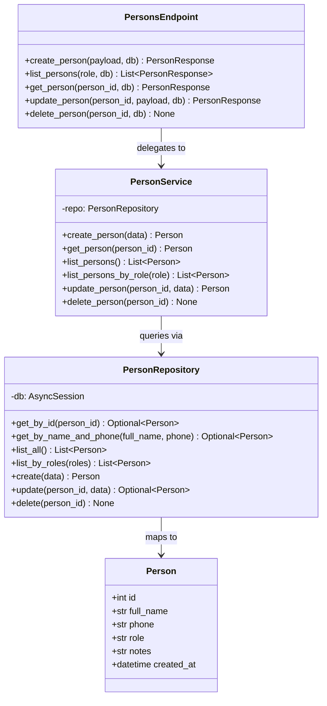

## Person Classes

This diagram shows the four classes that make up the persons module and how they relate to each other. `PersonsEndpoint` contains the five FastAPI route handler functions and delegates every operation to `PersonService`. `PersonService` holds all business logic — role validation and duplicate-name-plus-phone checks — and queries the database exclusively through `PersonRepository`. `PersonRepository` owns every SQL statement and maps rows to the `Person` SQLAlchemy model. Method signatures are taken verbatim from the source files.

