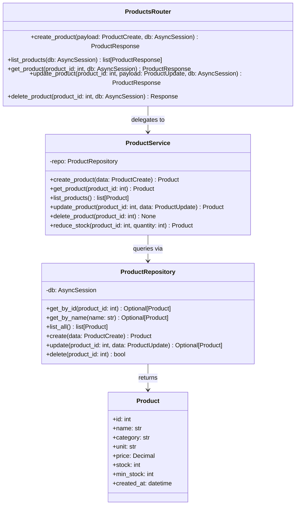

## Product Module — Class Diagram

This diagram shows the three active classes in the products module and how they delegate responsibility downward. Method signatures are taken verbatim from `backend/app/api/v1/endpoints/products.py`, `backend/app/services/product_service.py`, and `backend/app/repositories/product_repository.py`. The `Product` model class is included to show what the repository returns.

