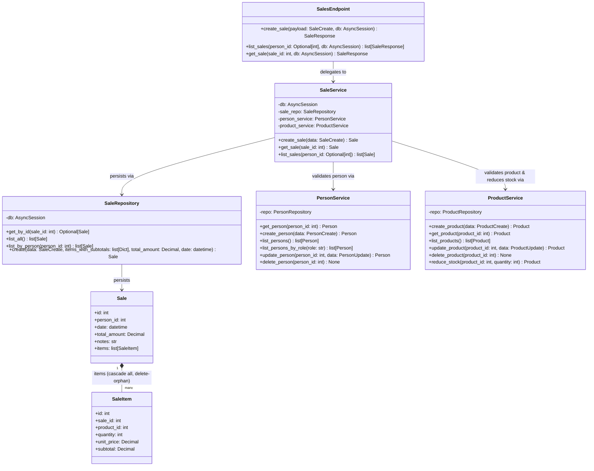

## Sales Module — Class Diagram

This diagram shows the classes that make up the sales module and the supporting classes they depend on. `SalesEndpoint` delegates all logic to `SaleService`, which owns a `SaleRepository` and delegates person and product validation/mutation to `PersonService` and `ProductService` respectively. There is no separate `SaleItemRepository` — `SaleItem` rows are created and deleted entirely through the `Sale.items` relationship (`cascade="all, delete-orphan"`), so `SaleRepository` is the only repository that persists sales and their line items together in `create()`. Method signatures are taken directly from the source files; `Sale` and `SaleItem` are SQLAlchemy ORM models (fields listed, no methods).

Note: `SaleItem` rows have no dedicated repository — they are created, read, and deleted exclusively through the `Sale.items` ORM relationship inside `SaleRepository`.
