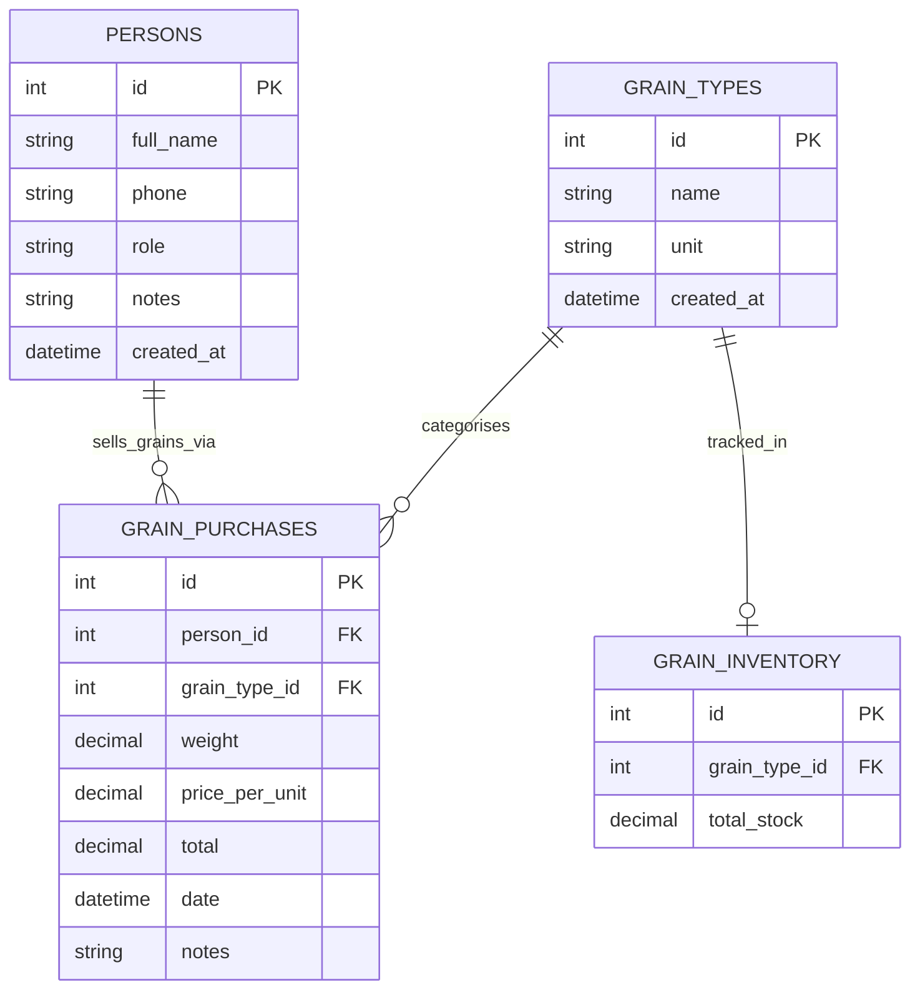

## Grain Purchases ERD

This diagram covers the `grain_purchases` and `grain_inventory` tables together with the `persons` and `grain_types` catalog tables they reference. `grain_purchases` records every individual transaction in which the store buys grain from a farmer, storing the weight, price per unit, and the pre-calculated total. `grain_inventory.total_stock` is not entered manually — it is updated automatically on every purchase creation via `GrainInventoryRepository.add_stock()`, which either increments an existing row or inserts a new one.

