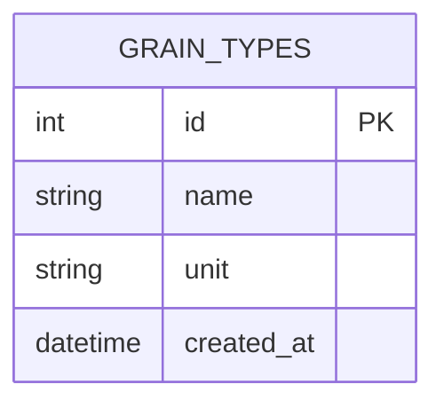

## Grain Types — ERD

The `grain_types` table is a catalog that holds the types of grains the store accepts from farmers (e.g., coffee, corn, beans). It is a read-only catalog from the API's perspective: rows are seeded and maintained exclusively through Alembic seed migrations, not through any endpoint or service. There are no CRUD endpoints for this table. In a future iteration, `grain_purchases` will reference this table via a `grain_type_id` foreign key (not yet implemented — the relationship is intentionally omitted from this diagram).

