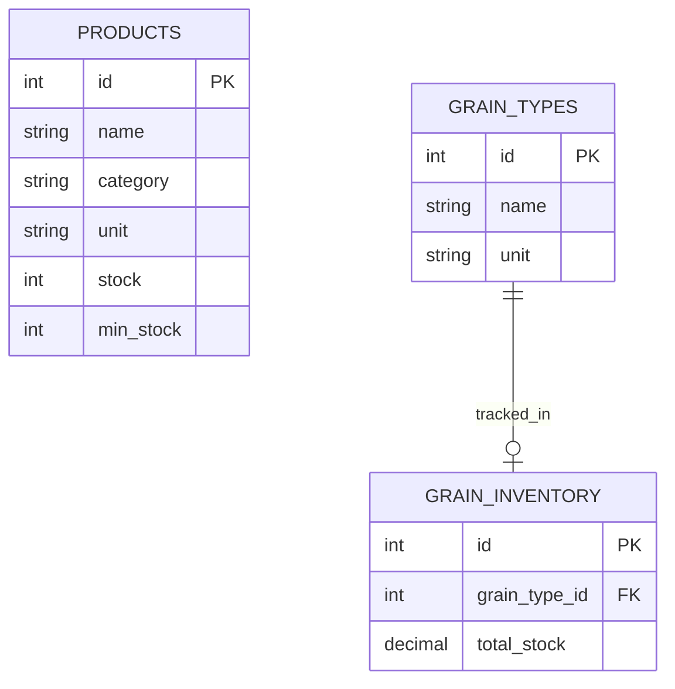

## Inventory ERD

The inventory module introduces **no new tables and no migrations**. It is a read-only reporting layer over tables owned by other modules: `products` (owned by the Products module) and `grain_inventory`/`grain_types` (owned by the Grain Purchases module). `InventoryService` only issues `SELECT` queries via `ProductRepository.list_all()`, `GrainTypeRepository.get_all()`, and the newly added `GrainInventoryRepository.list_all()` — stock values (`products.stock`, `grain_inventory.total_stock`) are still written exclusively by the sales flow (`ProductService.reduce_stock()`) and the grain purchase flow (`GrainInventoryRepository.add_stock()`). Columns shown below are limited to those actually consumed by `InventoryService`; see `erd/product_erd.md` and `erd/grain_purchase_erd.md` for the full column sets of these tables.

**Note:** `PRODUCTS` has no diagrammed relationship here because the inventory module reads it directly with no join — each row maps 1:1 to a `ProductInventoryResponse`. `GRAIN_TYPES ||--o| GRAIN_INVENTORY` reflects that a grain type may have zero (not yet purchased) or one `grain_inventory` row (`grain_type_id` is `unique` on `grain_inventory`); `InventoryService.list_grain_inventory()` iterates `GRAIN_TYPES` and defaults missing rows to `Decimal("0")` so every catalog grain type is always represented in the response, even with no purchases.
