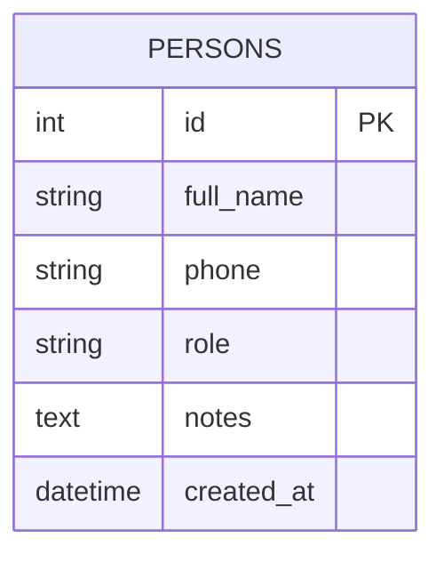

## Person ERD

The `persons` table is the single entity that represents every human contact in the system. A person's `role` column — constrained to `customer`, `farmer`, or `both` — determines which business flows they participate in: customers appear in sales transactions and farmers appear in grain purchases. Both FK relationships are planned but not yet implemented; once those modules exist, `sales.customer_id` and `grain_purchases.farmer_id` will reference `persons.id`. Those future references are intentionally omitted from the diagram below — only what currently exists in the database is shown.

