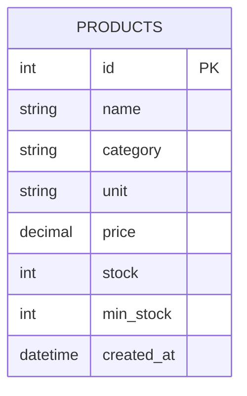

## Product ERD

The `products` table is the central catalog of agricultural inputs sold by the store (seeds, fertilizers, herbicides, fungicides). It is the only model in the products module at this stage; relationships to `sale_items` will be added when the Sales module is implemented. All column names, types, and constraints are taken directly from `backend/app/models/product.py`.

