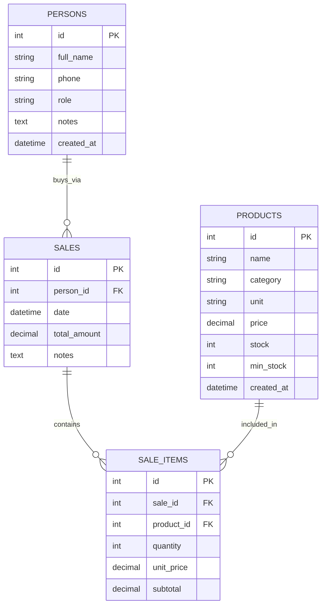

## Sales ERD

This diagram covers the `sales` and `sale_items` tables together with the `persons` and `products` tables they reference. `sales` records a single outbound transaction with a customer-eligible `Person` (role `customer` or `both`); `sale_items` stores the immutable line items of that transaction, each linked to a `Product`. `total_amount` on `sales` and `subtotal` on each `sale_items` row are always server-calculated by `SaleService.create_sale()` — never trusted from client input. The `Sale.items` relationship uses `cascade="all, delete-orphan"`, so line items are created and deleted together with their parent sale. All column names and types are taken directly from `backend/app/models/sale.py` and `backend/app/models/sale_item.py`.

