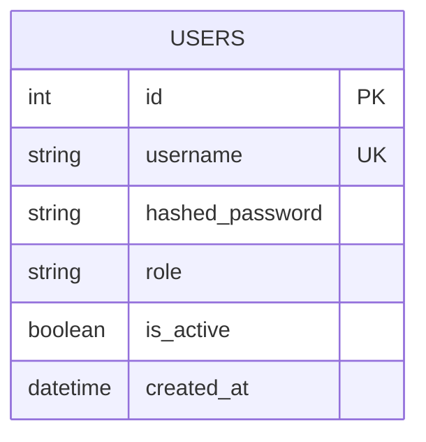

## User ERD

This diagram covers the `users` table, sourced from `backend/app/models/user.py`. It underpins the auth module's JWT-based authentication and role-based access control (RBAC): `username` is unique and used as the JWT `sub` claim, `hashed_password` stores a bcrypt hash (via `passlib`, never the plaintext password), `role` is one of `admin` / `clerk` and is embedded directly in the JWT payload so `require_admin`/`require_clerk` can authorize requests without a DB lookup, and `is_active` lets an admin deactivate an account (`PATCH /api/v1/users/{id}/deactivate`) without deleting it — there is no delete endpoint. Unlike every other table in the schema, `users` has **no foreign key relationships** to any domain table (`persons`, `products`, `sales`, `grain_purchases`, etc.) — auth is orthogonal to the domain model, it only gates access to it.

