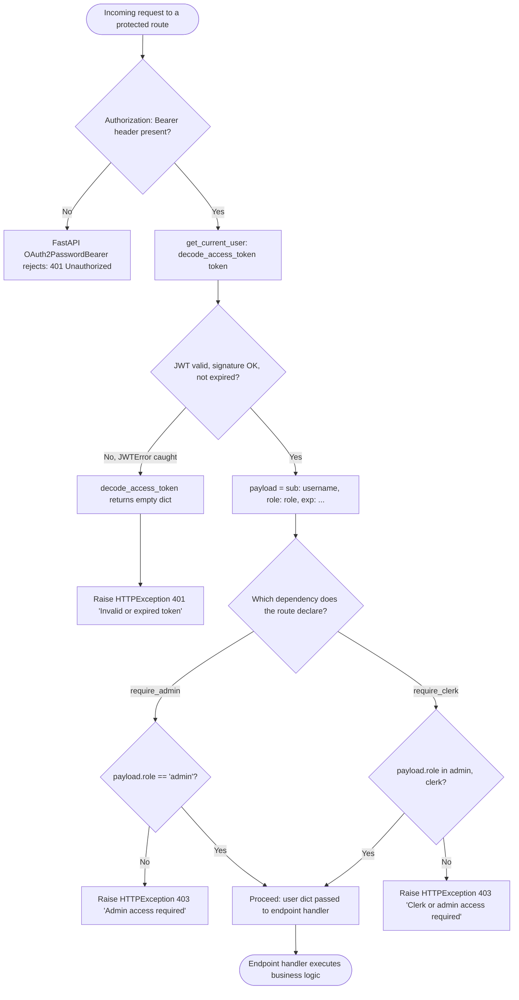

## RBAC Permission Check — Flowchart

This flowchart traces the branching logic across `get_current_user`, `require_admin`, and `require_clerk` in `backend/app/core/dependencies.py`, backed by `decode_access_token()` in `backend/app/core/security.py`. FastAPI resolves the `Authorization: Bearer <token>` header via `OAuth2PasswordBearer` before `get_current_user` ever runs (a missing header is rejected by that scheme itself). `decode_access_token()` returns `{}` for any decoding failure — expired, malformed, or bad-signature JWTs are indistinguishable at this layer, all resulting in a `401`. Which role-check dependency runs next (`require_admin` vs `require_clerk`) depends entirely on which route declared it: `require_admin` is used by `users.py`, `reports.py`, and the write operations (`POST`/`PATCH`/`DELETE`) of `products.py`; `require_clerk` is used by `sales.py`, `grain_purchases.py`, `persons.py`, `inventory.py`, and the read (`GET`) operations of `products.py`. An `admin` token satisfies both checks since `require_clerk` accepts `role in (admin, clerk)`.

