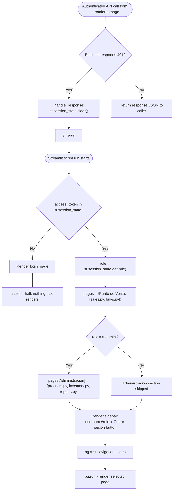

## Frontend Navigation Gate — Flowchart

This flowchart traces the branching logic that runs at the top of every Streamlit script execution in `frontend/app.py`, together with the 401-triggered session-clearing path in `frontend/shared/api_client.py` (`_handle_response()`). On every run, the app checks whether `access_token` is present in `st.session_state`. If it is missing, it renders `login_page()` and calls `st.stop()` immediately — nothing below that point (sidebar, page registration, `st.navigation`) executes. If present, it reads `role` from `st.session_state` and always registers the "Punto de Venta" pages (`pos/sales.py`, `pos/buys.py`); it additionally registers the "Administración" pages (`admin/products.py`, `admin/inventory.py`, `admin/reports.py`) only when `role == "admin"`. Any other role value (e.g. `"clerk"`) simply skips that branch — there is no explicit rejection, the admin pages are just never added to the `pages` dict passed to `st.navigation()`.

Separately, any authenticated API call made from an already-rendered page (via `api_client.py` helpers) can receive a `401` from the backend — for example if the token expired mid-session. `_handle_response()` reacts by clearing `st.session_state` entirely and calling `st.rerun()`, which re-enters this exact same gate on the next script run; since `access_token` is now absent, the user is routed back to the login page.

**This gate is frontend UX only — it is not a security boundary.** `role == "admin"` here only controls whether admin pages are *offered* in the sidebar. A client could in principle call an admin-only backend endpoint directly, bypassing the frontend nav entirely; the request would still be rejected by the backend's `require_admin`/`require_clerk` dependencies (see `flows/auth_rbac_check_flow.md`), since those are the actual enforcement point.

