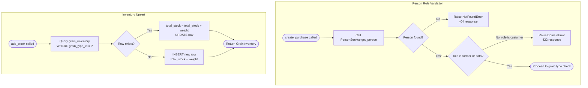

## Grain Purchase Business Rules — Flowchart

This diagram combines the two core business rules enforced by the grain purchases module. Subgraph A covers person role validation as implemented in `GrainPurchaseService.create_purchase()`: the service calls `PersonService.get_person()` which raises `NotFoundError` if the person does not exist, and then the service itself raises `DomainError` if the person's role is `customer`. Subgraph B covers the inventory upsert logic inside `GrainInventoryRepository.add_stock()`: the repository checks whether a `grain_inventory` row already exists for the grain type — if it does, it increments `total_stock` by the purchased weight; if it does not, it inserts a new row with `total_stock` set to that weight.

