## Inventory Low Stock & Defaulting — Flowchart

This flowchart covers the two computed-value branches inside `InventoryService`, sourced from `backend/app/services/inventory_service.py`. In `list_product_inventory()`, every `Product` gets a `low_stock` flag computed as `stock <= min_stock`. In `list_grain_inventory()`, every `GrainType` in the catalog is checked against the `{grain_type_id: total_stock}` lookup built from `GrainInventoryRepository.list_all()`; grain types with no matching `grain_inventory` row default to `Decimal("0")` rather than being omitted. Neither branch writes to the database — both are pure read/compute steps.

```mermaid
flowchart TD
    subgraph PRODUCT["Product low-stock detection"]
        A([list_product_inventory called]) --> B[product_repo.list_all]
        B --> C[For each product]
        C --> D{stock <= min_stock?}
        D -- Yes --> E[low_stock = true]
        D -- No --> F[low_stock = false]
        E --> G[Build ProductInventoryResponse]
        F --> G
        G --> H{More products?}
        H -- Yes --> C
        H -- No --> I([Return list of ProductInventoryResponse])
    end

    subgraph GRAIN["Grain inventory defaulting"]
        J([list_grain_inventory called]) --> K[grain_type_repo.get_all]
        K --> L[grain_inventory_repo.list_all]
        L --> M[Build stock_by_grain_type lookup:<br/>grain_type_id to total_stock]
        M --> N[For each grain_type in grain_types]
        N --> O{grain_inventory row exists<br/>for this grain_type_id?}
        O -- Yes --> P[total_stock = stock_by_grain_type value]
        O -- No --> Q[total_stock = Decimal 0]
        P --> R[Build GrainInventoryResponse]
        Q --> R
        R --> S{More grain types?}
        S -- Yes --> N
        S -- No --> T([Return list of GrainInventoryResponse])
    end
```

