## Person Role Validation and Duplicate Check Flow

This diagram combines the two core business-rule gates applied before any person is written to the database. The top subgraph (`CREATE`) shows the sequential checks inside `PersonService.create_person`: first, the submitted `role` must be one of `{customer, farmer, both}`; then, if and only if a `phone` value is present, the repository looks for an existing record with the same `full_name` and `phone`. Two persons sharing the same name but both having `phone = None` are **not** considered duplicates — the repository short-circuits and returns `None` immediately. The bottom subgraph (`UPDATE`) shows the extra guard inside `PersonService.update_person`: if the matched record's `id` equals the `person_id` being updated, the record is the same person and no duplicate error is raised; only a truly different person with the same name and phone triggers the error.

```mermaid
flowchart TD
    subgraph CREATE ["create_person — validation flow"]
        A([Person data received]) --> B{role in VALID_ROLES?}
        B -- No --> C[Raise DuplicateError: invalid role\n409 Conflict]
        B -- Yes --> D{phone is None?}
        D -- Yes --> E[Skip duplicate check\nTwo persons with same name\nand no phone are not duplicates]
        D -- No --> F[repo.get_by_name_and_phone\nfull_name + phone]
        F --> G{Person found?}
        G -- Yes --> H[Raise DuplicateError: name+phone exists\n409 Conflict]
        G -- No --> I[repo.create - data]
        E --> I
        I --> J([Return Person])
    end

    subgraph UPDATE ["update_person — duplicate guard"]
        K([name or phone field in payload]) --> L{full_name or phone\nbeing updated?}
        L -- No --> M[Skip duplicate check]
        L -- Yes --> N[Compute effective_name and effective_phone\nuse new value if provided else keep current]
        N --> O[repo.get_by_name_and_phone\neffective_name + effective_phone]
        O --> P{Person found?}
        P -- No --> Q[No duplicate - proceed]
        P -- Yes --> R{found.id == person_id?}
        R -- Yes --> Q
        R -- No --> S[Raise DuplicateError: name+phone exists\n409 Conflict]
        Q --> T[repo.update - person_id, data]
        M --> T
        T --> U([Return updated Person])
    end
```

