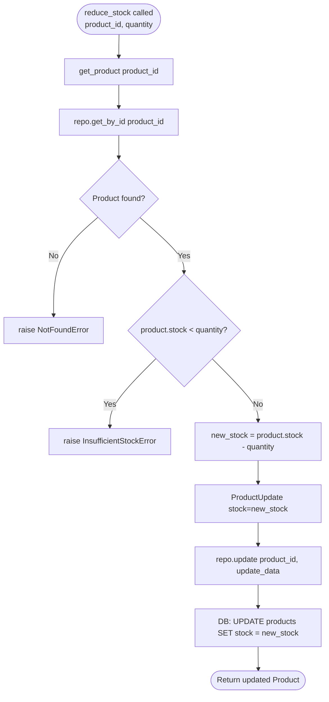

## Product Stock Validation — Flowchart

This flowchart traces every branch inside `ProductService.reduce_stock()` as it exists in `backend/app/services/product_service.py`. The method first delegates product lookup to `get_product()`, which itself raises `NotFoundError` when the product does not exist. It then compares current stock against the requested quantity and raises `InsufficientStockError` when stock is insufficient. Only when both guards pass does it compute the new stock value and persist the update via the repository.

