## Reporting Date Defaulting & Range Validation — Flowchart

This flowchart covers the date-handling logic shared by all three report endpoints, sourced from `backend/app/services/report_service.py`. The two single-date reports (`get_daily_sales_report`, `get_daily_grain_purchase_report`) each default a missing `date` query parameter to `_today()` (`datetime.now(timezone.utc).date()`, matching the UTC convention already used by `Sale`/`GrainPurchase` via `server_default=func.now()`). The range report (`get_top_sold_products`) independently defaults `start_date` and `end_date` to today, then validates `start_date <= end_date` before ever calling `ReportRepository`; a violation raises `DomainError`, which is translated to an HTTP `422` by the global exception handler in `main.py`. No branch performs any database write.

```mermaid
flowchart TD
    subgraph SINGLE["Single-date reports: sales/daily and grain-purchases/daily"]
        A([Endpoint called with optional date]) --> B{date param provided?}
        B -- Yes --> C[target_date = date]
        B -- No --> D[target_date = _today, UTC]
        C --> E[Query report data for target_date]
        D --> E
        E --> F([Return report response])
    end

    subgraph RANGE["Range report: products/top-sold"]
        G([Endpoint called with optional start_date, end_date]) --> H[today = _today, UTC]
        H --> I{start_date provided?}
        I -- Yes --> J[start_date = start_date]
        I -- No --> K[start_date = today]
        J --> L{end_date provided?}
        K --> L
        L -- Yes --> M[end_date = end_date]
        L -- No --> N[end_date = today]
        M --> O{start_date <= end_date?}
        N --> O
        O -- No --> P[Raise DomainError]
        P --> Q[FastAPI handler returns 422]
        O -- Yes --> R[get_top_products_by_range start_date, end_date, limit=10]
        R --> S([Return TopSoldProductsReport])
    end
```

