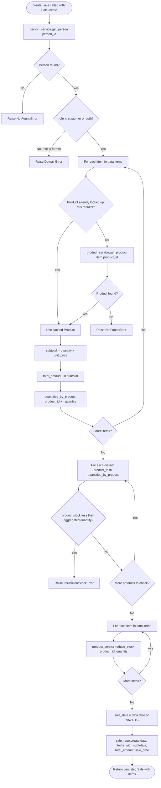

## Sale Validation — Flowchart

This flowchart traces every branch inside `SaleService.create_sale()` as it exists in `backend/app/services/sale_service.py`. The method first validates the person exists and has a customer-eligible role (`customer` or `both`), rejecting `farmer` with a `DomainError`. It then validates that every product referenced in the submitted items exists (raising `NotFoundError` on the first missing one), while accumulating each line item's `subtotal`, the running `total_amount`, and quantities aggregated per `product_id`. Only after all items have been validated does it check aggregated stock availability for every distinct product — before reducing any stock — so a sale never partially fails after stock was already reduced. If stock is sufficient for all products, it reduces stock per line item and persists the sale.

