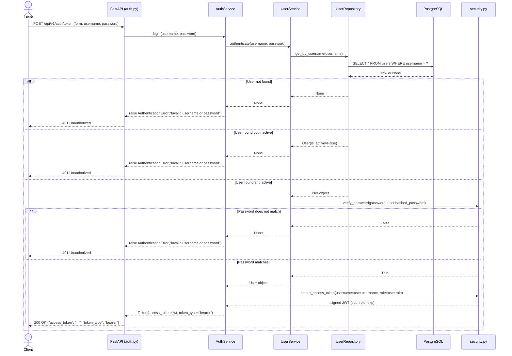

## Auth Login — Sequence Diagram

This diagram traces the full cross-layer flow for `POST /api/v1/auth/token`, sourced from `backend/app/api/v1/endpoints/auth.py`, `backend/app/services/auth_service.py`, `backend/app/services/user_service.py`, `backend/app/repositories/user_repository.py`, and `backend/app/core/security.py`. This is the only endpoint in the entire API with no auth dependency — it is how a client obtains a token in the first place. The client submits `username`/`password` as an OAuth2 password-grant form (`OAuth2PasswordRequestForm`, not JSON). `AuthService.login()` delegates credential verification to `UserService.authenticate()`, which looks up the user by username, rejects a missing or inactive user, and verifies the bcrypt hash via `verify_password()` — all three failure cases collapse to the same `None` result so the client cannot distinguish "unknown user" from "wrong password" from "inactive account". On success, `create_access_token()` signs a JWT with `{"sub": username, "role": role, "exp": ...}` and the endpoint returns a `Token` schema whose field is named `access_token`, per the OAuth2 standard.

