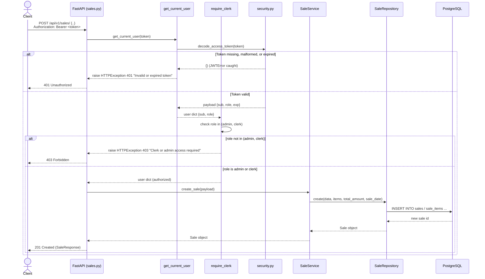

## Protected Request (RBAC) — Sequence Diagram

This diagram traces a protected request end-to-end using `POST /api/v1/sales/` as the concrete example, sourced from `backend/app/api/v1/endpoints/sales.py`, `backend/app/core/dependencies.py`, and `backend/app/core/security.py`. Every route except `POST /api/v1/auth/token` depends on `require_admin` or `require_clerk`, both of which depend on `get_current_user`. `get_current_user` extracts the bearer token via FastAPI's `OAuth2PasswordBearer`, calls `decode_access_token()` (which swallows any `JWTError` — expired, malformed, or bad signature — and returns `{}`), and raises `401` if the payload is empty. `require_clerk` (used by `sales.py`, `grain_purchases.py`, `persons.py`, `inventory.py`) then checks `role in ("admin", "clerk")`; `require_admin` (used by `users.py`, `reports.py`, and the write endpoints of `products.py`) checks `role == "admin"` — so an admin token satisfies both. Only once these dependencies resolve does the endpoint handler run and delegate to the normal service/repository/DB chain.

