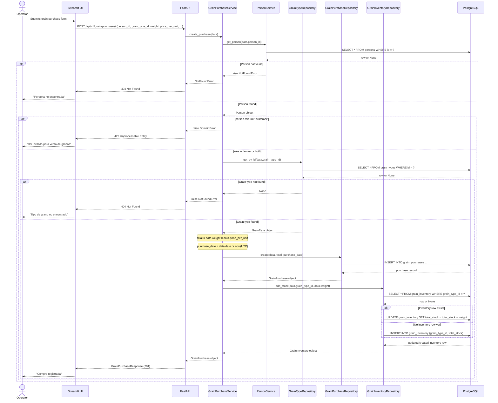

## Grain Purchase Creation — Sequence Diagram

This diagram shows the full cross-layer flow for `POST /api/v1/grain-purchases/`. The happy path runs left-to-right through the Streamlit UI, the FastAPI endpoint, `GrainPurchaseService`, and three repositories before writing to PostgreSQL. Two failure branches short-circuit the flow early: if the person is not found `PersonService.get_person()` raises `NotFoundError` (→ 404), and if the person's role is `customer` the service raises `DomainError` (→ 422). A third failure branch fires if the grain type is not found. On the happy path the service auto-calculates `total = weight × price_per_unit`, persists the purchase record, and then performs an inventory upsert as a distinct final step.

