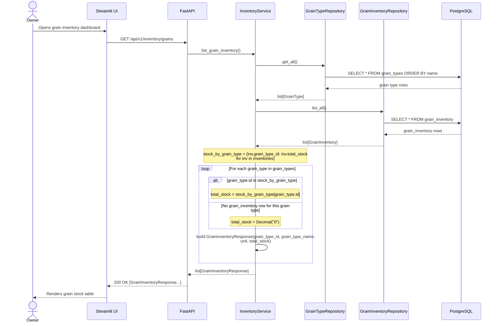

## Grain Inventory Listing — Sequence Diagram

This diagram traces `GET /api/v1/inventory/grains`, sourced from `backend/app/api/v1/endpoints/inventory.py` and `backend/app/services/inventory_service.py`. `InventoryService.list_grain_inventory()` reads the full grain type catalog via `GrainTypeRepository.get_all()` and all existing stock rows via the newly added `GrainInventoryRepository.list_all()`, builds an in-memory `{grain_type_id: total_stock}` lookup from the latter, then iterates every `GrainType` and defaults to `Decimal("0")` when no matching `grain_inventory` row exists — guaranteeing every catalog grain type appears in the response even if it has never been purchased. This flow performs no writes: `add_stock()` is never called here.

