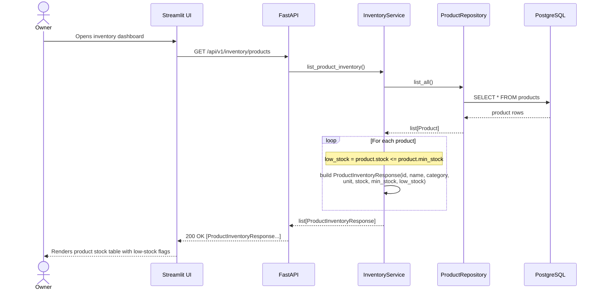

## Product Inventory Listing — Sequence Diagram

This diagram traces `GET /api/v1/inventory/products`, sourced from `backend/app/api/v1/endpoints/inventory.py` and `backend/app/services/inventory_service.py`. `InventoryService.list_product_inventory()` fetches every row from `products` via `ProductRepository.list_all()` (no filters — the module always reports the full catalog) and, for each `Product`, computes the `low_stock` flag as `stock <= min_stock` before mapping it into a `ProductInventoryResponse`. This flow performs no writes: it never calls `reduce_stock` or any other mutating repository method.

