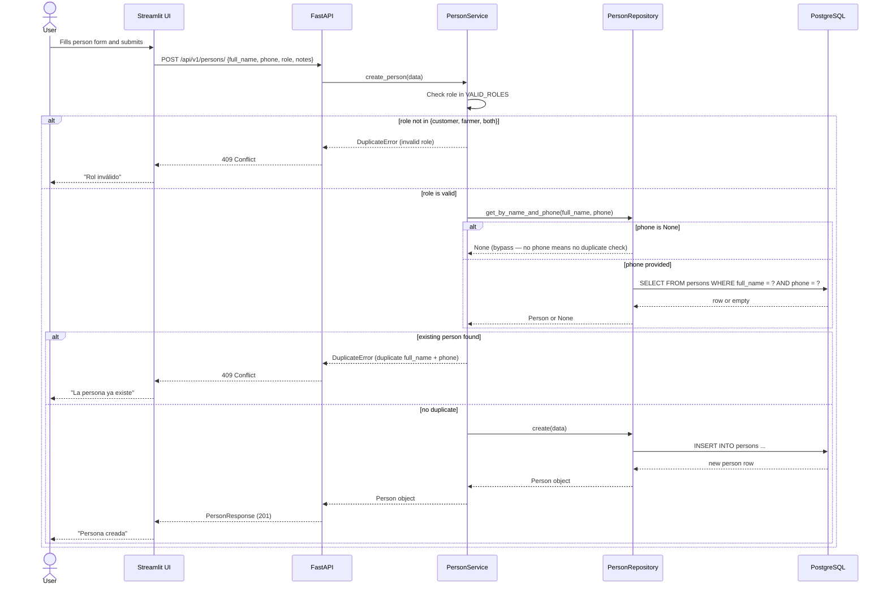

## Person Creation Sequence

This diagram traces the full cross-layer flow for `POST /api/v1/persons/`, from the Streamlit UI through FastAPI, `PersonService`, `PersonRepository`, and PostgreSQL. Two failure branches are shown: the first occurs when the submitted `role` is not one of the accepted values (`customer`, `farmer`, `both`), and the second occurs when a person with the same `full_name` and `phone` already exists in the database. Both failures result in a `DuplicateError` that FastAPI translates to a `409 Conflict` response.

