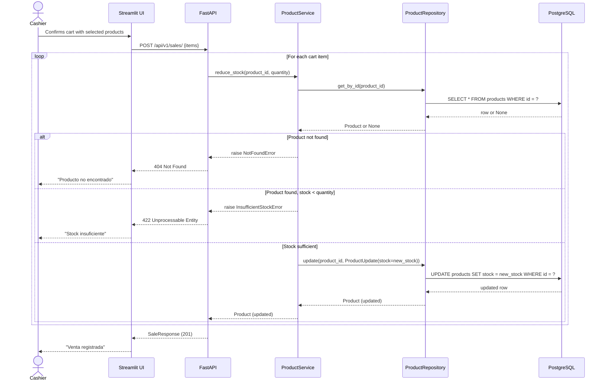

## Product Sale Flow — Sequence Diagram

This diagram traces how a sale triggers stock reduction across every layer of the architecture: the Streamlit POS UI calls FastAPI, which delegates to `ProductService`, which validates stock and then persists the change via `ProductRepository` to PostgreSQL. The `reduce_stock` logic is sourced directly from `backend/app/services/product_service.py`. The Sales endpoint that orchestrates this call will be added in the Sales module; the product-side sequence shown here is complete and final.

