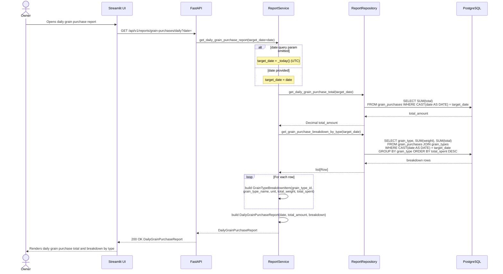

## Daily Grain Purchase Report — Sequence Diagram

This diagram traces `GET /api/v1/reports/grain-purchases/daily`, sourced from `backend/app/api/v1/endpoints/reports.py`, `backend/app/services/report_service.py`, and `backend/app/repositories/report_repository.py`. The optional `date` query parameter defaults to `ReportService._today()` (`datetime.now(timezone.utc).date()`) when omitted. `ReportService.get_daily_grain_purchase_report()` calls `ReportRepository.get_daily_grain_purchase_total()` for the summed `total_amount`, then `ReportRepository.get_grain_purchase_breakdown_by_type()` to aggregate `total_weight` and `total_spent` per grain type. Results are assembled into a `DailyGrainPurchaseReport`. This flow is entirely read-only — no rows in `grain_purchases` or `grain_types` are written.

