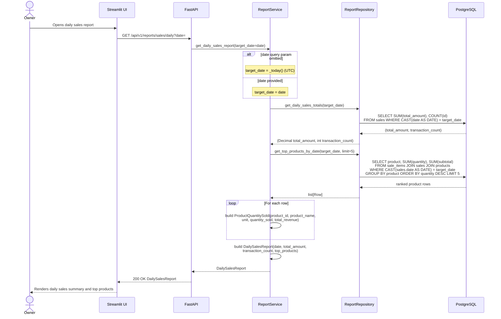

## Daily Sales Report — Sequence Diagram

This diagram traces `GET /api/v1/reports/sales/daily`, sourced from `backend/app/api/v1/endpoints/reports.py`, `backend/app/services/report_service.py`, and `backend/app/repositories/report_repository.py`. The optional `date` query parameter defaults to `ReportService._today()` (`datetime.now(timezone.utc).date()`) when omitted. `ReportService.get_daily_sales_report()` then calls `ReportRepository.get_daily_sales_totals()` for the summed `total_amount` and `transaction_count`, followed by `ReportRepository.get_top_products_by_date()` (limit 5) to rank products by quantity sold on that date. Results are assembled into a `DailySalesReport`. This flow is entirely read-only — no rows in `sales`, `sale_items`, or `products` are written.

