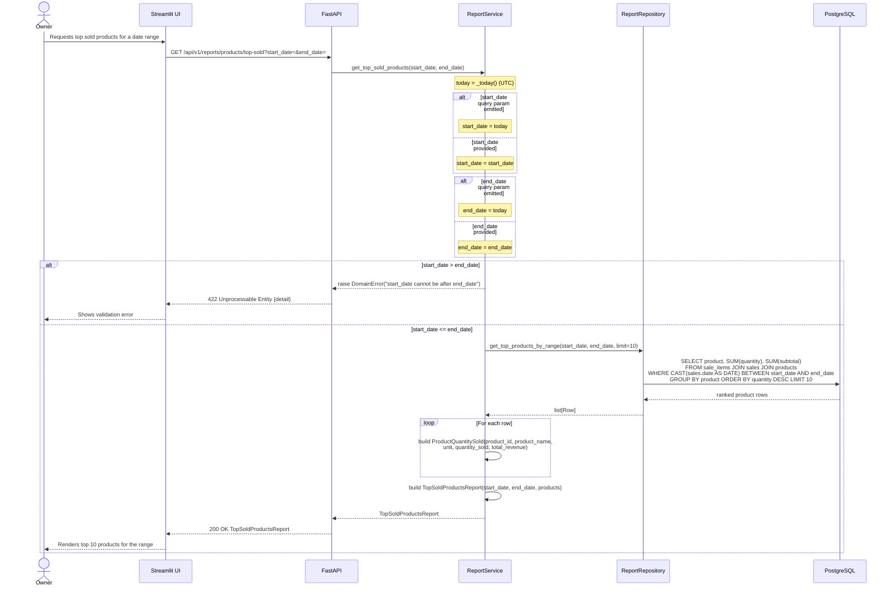

## Top Sold Products Report — Sequence Diagram

This diagram traces `GET /api/v1/reports/products/top-sold`, sourced from `backend/app/api/v1/endpoints/reports.py`, `backend/app/services/report_service.py`, and `backend/app/repositories/report_repository.py`. Both `start_date` and `end_date` query parameters independently default to `ReportService._today()` (`datetime.now(timezone.utc).date()`) when omitted. Before querying, `ReportService.get_top_sold_products()` validates `start_date <= end_date`; if violated it raises `DomainError`, which `main.py`'s exception handler converts to `422` and the query never reaches `ReportRepository`. When valid, `ReportRepository.get_top_products_by_range()` returns the top 10 products by quantity sold within the inclusive date range, assembled into a `TopSoldProductsReport`. This flow is entirely read-only.

