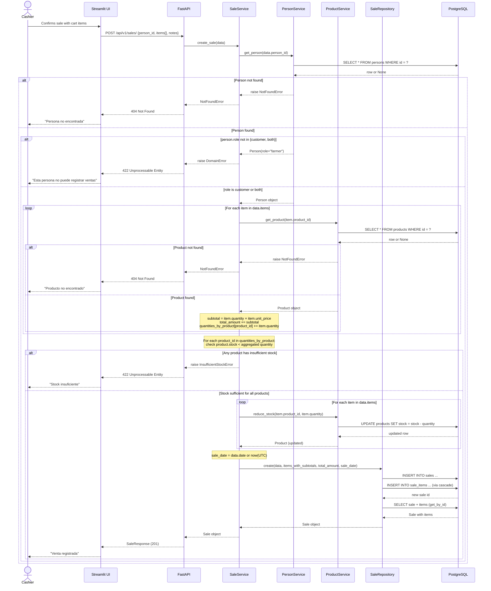

## Sale Creation — Sequence Diagram

This diagram traces the full cross-layer flow for `POST /api/v1/sales/`, sourced from `backend/app/api/v1/endpoints/sales.py` and `backend/app/services/sale_service.py`. `SaleService.create_sale()` first validates the person exists and has a customer-eligible role (`customer` or `both`) via `PersonService`, rejecting `farmer`. It then, for every submitted item, validates the product exists via `ProductService` (caching lookups per `product_id` within the request) while accumulating `subtotal`, `total_amount`, and per-product aggregated quantities — the total is never trusted from the client, it is always recomputed server-side. Only after every product's aggregated quantity is checked against its current stock does the service reduce stock per line item via `ProductService.reduce_stock()`, guaranteeing a sale never partially fails after stock was already reduced. Finally it persists the sale and its line items through `SaleRepository.create()`.

